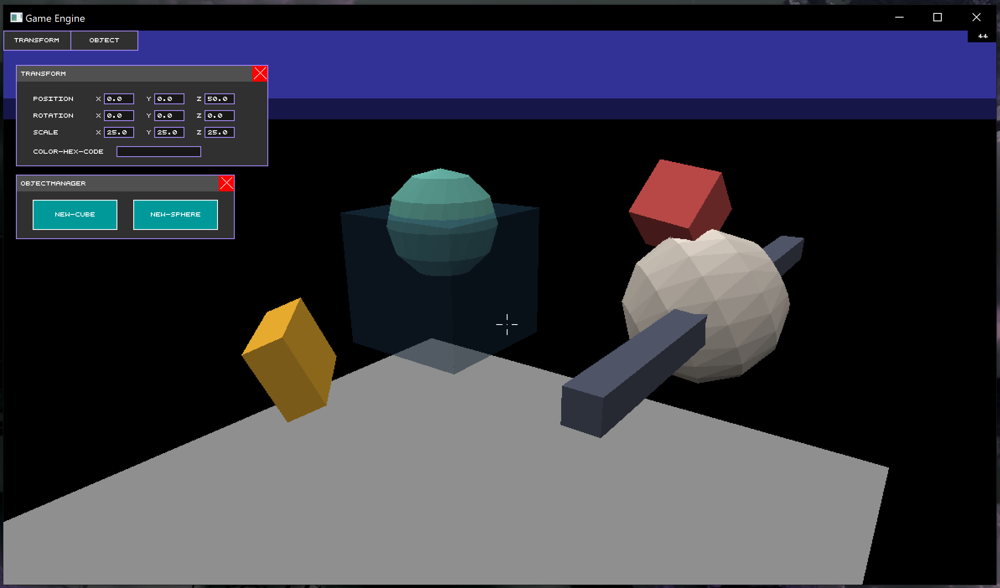

### 🗃️ Archived Project – This repository is no longer maintained.

---

# Kiwi3D

Kiwi3D is a 3D scene editor and game engine framework built from scratch in C++ using `windows.h` as the **only external include**. The project was developed as both a learning experience and a passion project, spanning over two years of work. All functionality—from windowing and rendering to UI and input handling—was implemented manually, with no third-party libraries.

This repository now serves as a **frozen, archived version** of the engine. While development on this version is complete, a future version is planned, featuring a full redesign using Vulkan and modern tools. This project remains a monument to what I built completely solo—and I’m proud to share it 😃

---

## Table of Contents

- [Kiwi3D](#kiwi3d)
- [Philosophy](#philosophy)
- [Key Features](#key-features)
  - [Rendering Pipeline](#rendering-pipeline)
  - [UI System](#ui-system)
  - [Testing & Benchmarking](#testing--benchmarking)
  - [Font Drawing](#font-drawing)
- [Controls](#controls)
- [🚀 How to Run](#how-to-run)
  - [Build Requirements](#build-requirements)
- [Project Structure](#project-structure)
- [📄 License](#license)
- [📝 Final Thoughts](#final-thoughts)

---

<h2 id="philosophy">Philosophy</h2>

The core philosophy behind this engine was simple: **write everything myself**. That meant no standard library (std), and no rendering libraries or engines. Just raw C++ and `windows.h`.

If I wanted a feature—like matrix math, alpha blending, or even a UI system—I had to figure it out and build it. That forced me to deeply understand the concepts I was working with, and it made the project incredibly rewarding.

---

<h2 id="key-features">Key Features</h2>

<h3 id="rendering-pipeline">Rendering Pipeline</h3>

The heart of this project is its software-based 3D renderer. Here's a rough outline of how it works:

- Objects are transformed into screen space using custom matrix math and perspective projection.
- Triangles are rasterized using bounding-box iteration, edge functions, and efficient depth interpolation via barycentric deltas.
- A z-buffer is used to handle proper depth sorting.
- Alpha blending is supported for rendering semi-transparent objects.

This is a **true pixel-based software renderer**, written entirely from scratch.

<h3 id="ui-system">UI System</h3>

The second major component is a fully custom, windowed UI system designed to make the engine interactive and configurable:

- **Hierarchy-based layout**: UI windows own elements, which can themselves contain children.
- **Custom XML-like layout language** for defining UI windows and their elements.
- **Dynamic action binding** via `Context` objects that allow elements to interact with engine state.
- **Reusable layouts**: Any window layout that defines a `<parameters>` section can be reused as a "custom element" inside other windows.
- Written with **flexibility and extensibility** in mind, this system is what turns the engine into something usable.

The UI system is lightweight, efficient, and essential for inspecting and interacting with objects in the scene.

<h3 id="testing--benchmarking">Testing & Benchmarking</h3>

- A custom **unit testing framework** was written to validate function behavior. Test results are exported as HTML for easy viewing.
- A simple but flexible **benchmarking system** allows performance testing for any part of the codebase.

Both systems are modular, reusable, and helped keep the engine stable during development.

<h3 id="font-drawing">Font Drawing</h3>

This system isn't flashy, but it's functional:

- Character glyphs are 7×7 on/off bitmaps stored directly in code.
- Drawing is pixel-based and monospace, with no smoothing or scaling.
- While simple and rigid, it's effective for debug output and basic UI labels.

---

<h2 id="controls">Controls</h2>

- **W / A / S / D / Space / Ctrl** — Move the camera freely (6DoF).
- **Left Click + Mouse** — Look around.
- **Right Click** — Select the object under the cursor; dynamically binds the transform window (if open).
- **Enter** — Deselect the current object.
- **Shift** — Sprint (increases movement speed).
- **G** — Toggle gravity (affects objects only, *not* the camera).
- **Z** — Adds vertical velocity to all objects (makes them "jump").

---

<h2 id="how-to-run">🚀 How to Run</h2>

1. Clone this repository.
2. Navigate to `root/build/`.
3. Run `BuildAll+Run.bat`.

This script will compile all components to `.o` files and launch the engine. It may take a moment—there’s a lot to build.

<h3 id="build-requirements">Build Requirements</h3>

This engine is **Windows-only** and depends on `windows.h`.

- **Compiler**: GCC via MinGW (uses `g++` under the hood)
- **Architecture**: Built and tested for **x86_64 (64-bit)** systems
- **Optimization**: Compiled with `-Ofast` for speed
- **Standard**: Written for **C++17**

⚠️ **Note**: This project has very limited testing outside my own development environment.  
Your mileage may vary depending on your compiler version or system configuration.

---

<h2 id="project-structure">Project Structure</h2>

Most directories are documented with a README, but here's a high-level overview:

- `build/` — Contains the build scripts, runtime log, and compiled `.exe`.
- `legacy/` — Deprecated code, experiments, and old sketches. None of this contributes to the build, but it’s retained for archival value.
- `src/` — The core of the engine:
  - `assets/` — Non-code files used by the engine (e.g., UI layouts).
  - `include/` — All header files (`.h`).
  - `obj/` — Output directory for compiled object files (`.o`).
  - `src/` — All implementation files (`.cpp`).
- `testing/` — Contains test files (not part of the main build).

---

<h2 id="license">📄 License</h2>

This project is licensed under the [GNU General Public License v3.0](./LICENSE).

You are free to use, modify, and distribute this software, as long as any derivative work is also shared under the same license.

SPDX-License-Identifier: GPL-3.0

<h3 id="why-gpl">Why GPL?</h3>

I chose the GPL for one simple reason: it reflects exactly how I want this work to be used.  
I have no problem with people using my code however they like—**as long as it stays open source**.  

This engine represents a lot of work on my end, and I'm proud to share it freely.  
The GPL ensures that no one can take advantage of that by locking it behind closed doors.  
If this code helps someone, that’s awesome—I just want that openness to continue forward.

---

<h2 id="final-thoughts">📝 Final Thoughts</h2>

> This was very much a passion project for me. As much as it was a chance to grow as a programmer, it was also just *fun*. Every part of this engine reflects something I wanted to build, understand, or improve.  
> I poured a lot of time into this—somewhere north of 17,000 lines of code and hundreds of hours. It’s not perfect, but it’s mine, and it’s finished. And I’m proud of that.  
> Development now shifts to a collaborative, Vulkan-powered version—but this version will always stand as a milestone in my growth as a developer.  
> — **Linden Sheehy**
